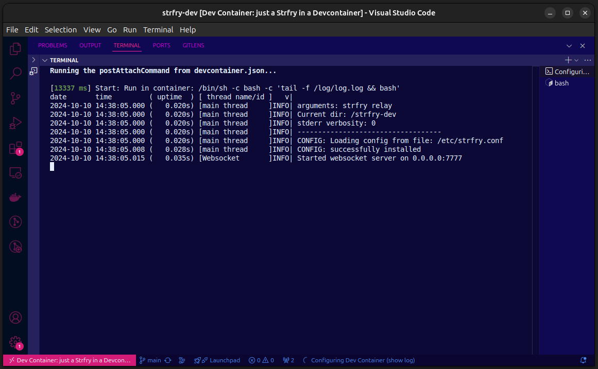

> Matthew 5
> [43] Ye have heard that it hath been said, Thou shalt love thy neighbour, and hate thine enemy. [44] But I say unto you, Love your enemies, bless them that curse you, do good to them that hate you, and pray for them which despitefully use you, and persecute you; [45] That ye may be the children of your Father which is in heaven: *for he maketh his sun to rise on the evil and on the good, and sendeth rain on the just and on the unjust.*

# Strfry in Devcontainer
To use to local teste as dev environment.

## Dependency
Docker, docker-compose and devcontainer

## Execute
`sh setup.sh`
`devcontainer open .`

To run without vscode:
`docker-compose -f .devcontainer/docker-compose.yml up`
